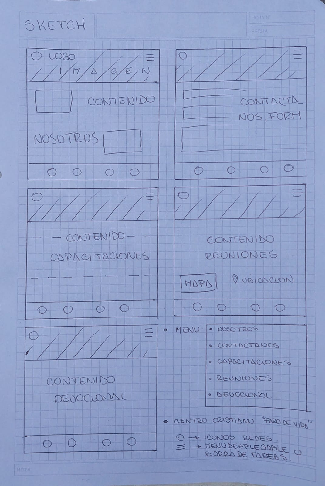

# TPF_BAmultiplica

<a href="https://abrissonhold.github.io/TPF_BAmultiplica/layout">Ir a 📄 </a>
 

TECNOLOGÍAS
  
- HTML5  
- CSS3  
- JavaScript  
- Bootstrap 5.3.2  
- Git/Github

DESCRIPCIÓN 
  
Trabajo practico para el curso de BA multiplica, programación web inicial.
Realizado en html, se realizo un pagina web para un centro cristiano local
Primer proyecto en este lenguaje tiene archivos html y css (ademas de las imagenes)
El sketch tambien se encuentra para visualizar lo esperado del proyecto
 

